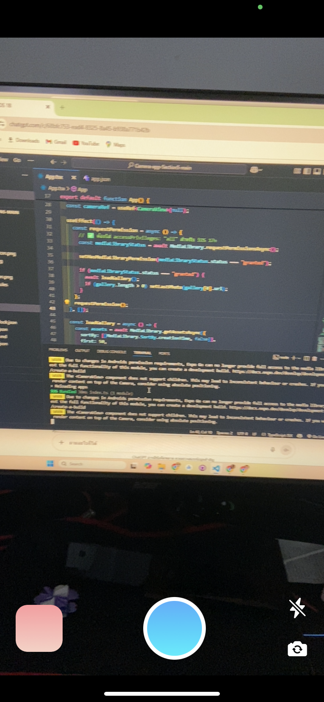

# 📸 Camera-app-Section5

แอปพลิเคชันกล้องที่ทันสมัยสร้างขึ้นด้วย **React Native** และ **Expo** พร้อม **TypeScript** แอปนี้ช่วยให้ผู้ใช้สามารถถ่ายภาพ ดูรูปภาพล่าสุดเป็นภาพขนาดย่อ บันทึกภาพไปยังคลังสื่อ และเรียกดูรูปภาพล่าสุดในแกลเลอรีด้วย UI ที่สวยงาม

## ✨ คุณสมบัติ

* 📷 **ถ่ายภาพ** โดยใช้กล้องหน้าหรือกล้องหลัง
* 🔦 **ควบคุมแฟลช**: เปิด / ปิด
* 🖼️ **แสดงตัวอย่างภาพขนาดย่อ** ของภาพถ่ายล่าสุด
* 🖌️ **มุมมองแกลเลอรี**: แสดงรูปภาพล่าสุดได้สูงสุด 50 รูป
* 💾 **บันทึกลงในคลังสื่อ** ได้ทันที
* 🌗 **UI ทันสมัย** พร้อมปุ่มโค้งมน, เงา, และเอฟเฟกต์การไล่ระดับสี
* 📱 **ตอบสนองบนมือถือ** ปรับให้เหมาะสมสำหรับสมาร์ทโฟน

## Screenshots

| Screenshot 1 | Screenshot 2 | Screenshot 3 |
|--------------|--------------|--------------|
|| 
 | 
 |


## 🛠️ เทคโนโลยีที่ใช้

* React Native
* Expo
* TypeScript
* Expo Camera (`expo-camera`)
* Expo Media Library (`expo-media-library`)
* React Native Vector Icons
* Animated API สำหรับเอฟเฟกต์ปุ่ม

## 🚀 เริ่มต้นใช้งาน

### ข้อกำหนดเบื้องต้น

* Node.js
* Expo CLI (`npm install -g expo-cli`)

### สร้างโปรเจกต์

สร้างโปรเจกต์ Expo ใหม่โดยใช้เทมเพลต **blank TypeScript**:

```bash
npx create-expo-app@latest camera-app --template blank-typescript
```

### ติดตั้งไลบรารีที่จำเป็น

ในการเข้าถึงกล้องและคลังสื่อ ให้ติดตั้ง:

```bash
cd camera-app
npx expo install expo-camera expo-media-library
```

> การใช้ `npx expo install` ช่วยให้มั่นใจได้ถึงความเข้ากันได้กับเวอร์ชัน Expo SDK ของคุณ

### เรียกใช้แอป

```bash
npx expo start
```

จากนั้นสแกนโค้ด QR ด้วย **Expo Go** หรือใช้โปรแกรมจำลอง

## 🔄 โครงสร้างโปรเจกต์

```
camera-app/
├── app/                      # Screens (หากใช้ Expo Router)
├── assets/
│   └── img/
│       └── camera-1.jpg      
├── components/               # Optional UI components
├── App.tsx                   # ไฟล์ App หลัก
├── package.json
└── README.md
```

## 👤 ผู้เขียน

**ธนโชค สุวรรณ์**

* 🌐 Facebook: [Thanachok Suwan](https://facebook.com/thanachok.boss)
* 💻 GitHub: [thanachok11](https://github.com/thanachok11)

---

สร้างสรรค์ด้วย ❤️ สำหรับรายวิชา *การเขียนโปรแกรมแอปพลิเคชันบนมือถือแบบไฮบริด* (**IN405109**)
**วิทยาการคอมพิวเตอร์, มหาวิทยาลัยขอนแก่น**
